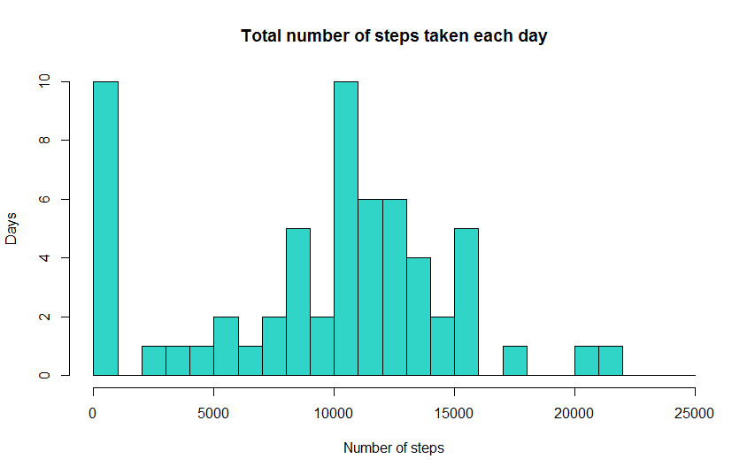
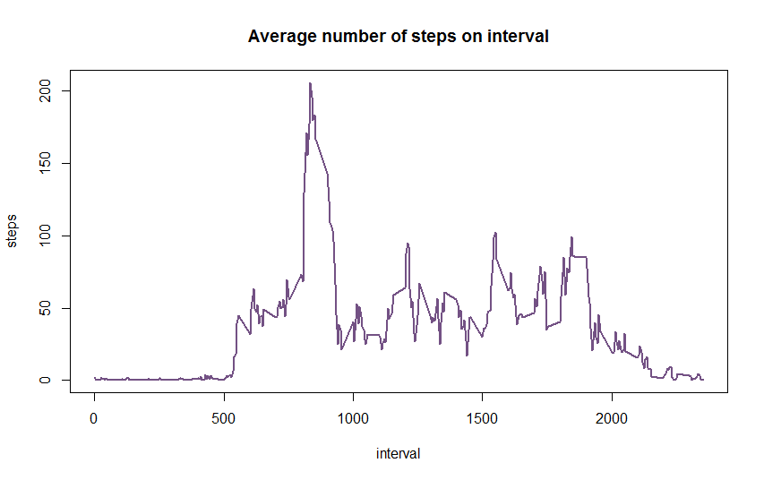
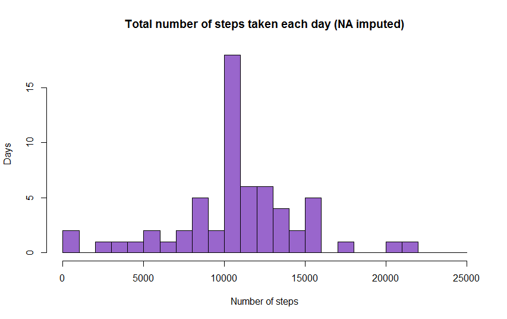
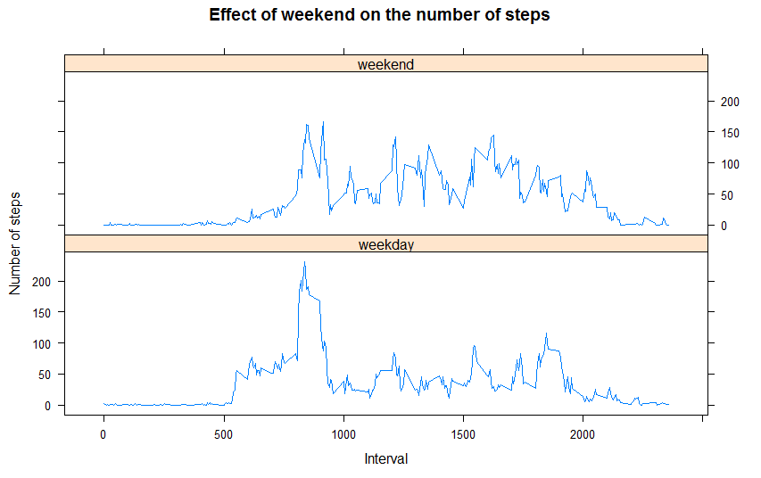

# PA1_template

##Loading the data from the activity.csv file provided

Reading the file **activity.csv** into a variable AMD for Activity Monitoring Device.


```r
AMD <- read.csv("activity.csv")
```

##Mean total number of steps taken per day

Summarizing number of steps for each day. As a result get the dataframe **StepsByDays** with the variables named **data** and **steps**.


```r
StepsByDays<-aggregate(AMD$steps,list(AMD$date),sum, na.rm=TRUE)
names(StepsByDays) <- c("date","steps")
```

Plot the histogram.


```r
hist(StepsByDays$steps,xlab="Number of steps", ylab="Days", main = "Total number of steps taken each day", 
       breaks=seq(from=0,to=25000,by=1000), col = "#30D5C8")
```



Counting mean and median values per day.


```r
mst <- round(mean(StepsByDays$steps))
mdst <-round(median(StepsByDays$steps))
print(paste("Mean value of steps per day =", mst))
```

```
## [1] "Mean value of steps per day = 9354"
```

```r
print(paste("Median value of steps per day =", mdst))
```

```
## [1] "Median value of steps per day = 10395"
```

##The average daily activity pattern

Averaging number of steps for each interval. As a result get the dataframe **StepsByInt** with the variables named **interval** and **steps**.


```r
StepsByInt <- aggregate(AMD$steps,list(AMD$interval),mean,na.rm=TRUE)
names(StepsByInt) <- c("interval","steps")
```

Ploting the histogram.


```r
with(StepsByInt, 
plot(interval,steps, type="l", col="#735184", lwd=2,
     main="Average number of steps on interval"))
```



Counting maximal average number of steps per interval and finding corresponding interval.


```r
mxsteps <- max(StepsByInt$steps)
print(paste("Interval witn maximalaverage number of steps =", StepsByInt[StepsByInt$steps==mxsteps,1]))    
```

```
## [1] "Interval witn maximalaverage number of steps = 835"
```

```r
print(paste("Maximal average number of steps =", round(mxsteps)))
```

```
## [1] "Maximal average number of steps = 206"
```

##Imputing missing values

Counting number of the observations with missed value of variable steps.


```r
q_na <- length(dfAct$steps[is.na(AMD$steps)])
print(paste("Total number of missed obsevations =", q_na))
```

```
## [1] "Total number of missed obsevations = 2304"
```


Changing NA values in dfAct to mean numbers of steps for this interval. Forming as a result the dataframe **dfActImp** with the variables **steps**, **date**, **interval**.


```r
aux <- merge(dfAct, StepsByInt, by = "interval")
aux$steps.x[is.na(aux$steps.x)] <- round(aux$steps.y[is.na(aux$steps.x)])
aux <- aux[order(aux$date,aux$interval),]
AMDImp <- aux[c("steps.x","date","interval")]
names(AMDImp) <- c("steps","date","interval")
```

Get the dataframe **StepsByDaysImp** as analogue of **StepsByDays** but with imputed NA values of steps.


```r
StepsByDaysImp<-aggregate(AMDImp$steps,list(AMDImp$date),sum, na.rm=TRUE)
names(StepsByDaysImp) <- c("date","steps")
```

Ploting the histogram for the imputed variant.


```r
hist(StepsByDaysImp$steps,xlab="Number of steps", ylab="Days", main = "Total number of steps taken each day (NA imputed)", breaks=seq(from=0,to=25000,by=1000), col = "#9966CC")
```



Counting the new version of mean and median values per day. Imputing missing data impacts on estimates but not so much.


```r
mstf <- round(mean(StepsByDaysImp$steps))
mdstf <-round(median(StepsByDaysImp$steps))
print(paste("Mean value of steps per day (NA imputed) =", mstf))
```

```
## [1] "Mean value of steps per day (NA imputed) = 10766"
```

```r
print(paste("Median value of steps per day (NA imputed) =", mdstf))
```

```
## [1] "Median value of steps per day (NA imputed) = 10762"
```

##Differences in activity patterns between Weekdays and Weekends

Plotting the chart to compare activity in weekends and weekdays.

```r
Sys.setlocale(locale = "USA")
```

```r
AMDImp$TypeOfDay <- as.factor(ifelse(weekdays((as.Date(AMDImp$date)))%in%c("Saturday","Sunday"),"weekend","weekday"))
library(lattice)
AMDImpWeek <- with(dfActImp, aggregate(steps,list(TypeOfDay,interval),mean))
names(AMDImpWeek) <- c("TypeOfDay","interval", "steps") 
mygraph <- xyplot(steps~interval|TypeOfDay, data = AMDImpWeek, type="l", layout=c(1,2),
                  main = "Effect of weekend on the number of steps",
                  ylab="Number of steps", xlab = "Interval")
plot(mygraph)
```


